# Azure Kubernetes Service (AKS) DevOps

This is a lab to create a zero downtime scenario for Azure Kubernetes Service (AKS).

## Prerequisties

- [Git](https://git-scm.com/book/en/v2/Getting-Started-Installing-Git) for Windows or Linux
- [Docker](https://docs.docker.com/install/) for Windows or Linux
- [Terraform](https://www.terraform.io/intro/getting-started/install.html) v1.19 or later for Windows or Linux
- [Istio](https://istio.io/docs/setup/kubernetes/download-release/) for Windows or Linux
- Azure CLI
- Windows 10 with WSL

## CI/CD Workflow

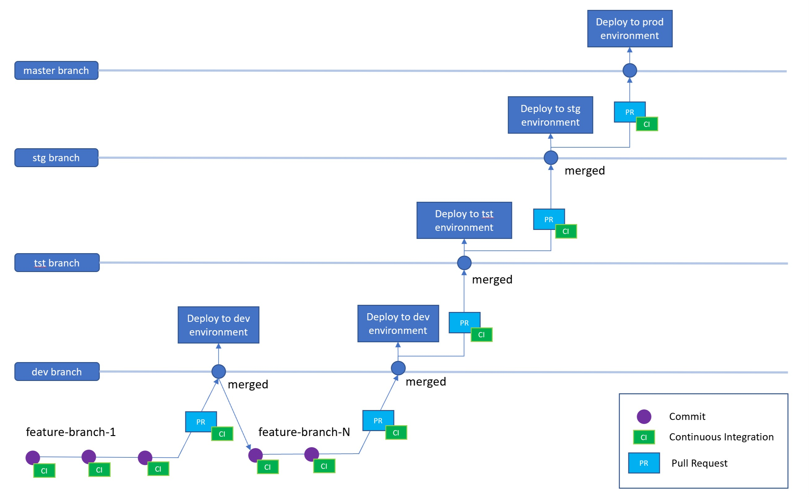

## Step 1: Setup an Azure DevOps Project

Azure DevOps Services allows you to easily set up automated pipelines to build, test and deploy your code to any platform. We are going to use Azure DevOps as our default platform. If you don't have an account, you can create one [here](https://azure.microsoft.com/en-us/services/devops/).


Now you can clone the repository locally:

    git clone https://<organization_name>@dev.azure.com/<organization_name>/<project_name>/_git/<project_name>

## Step 2: Setup Azure Active Directory for AKS authentication

AKS can be configured to use Azure Active Directory (AD) for user authentication. In this configuration, you can log into an AKS cluster using your Azure Active Directory authentication token. If you want to understand more about the authenticaton details you can find more info [here](https://docs.microsoft.com/en-us/azure/aks/aad-integration#authentication-details).

### **Active Directory tenant**

Integration with Active Directory requires a *tenant*. If you don't have an AD tenant, create one through Azure Portal:

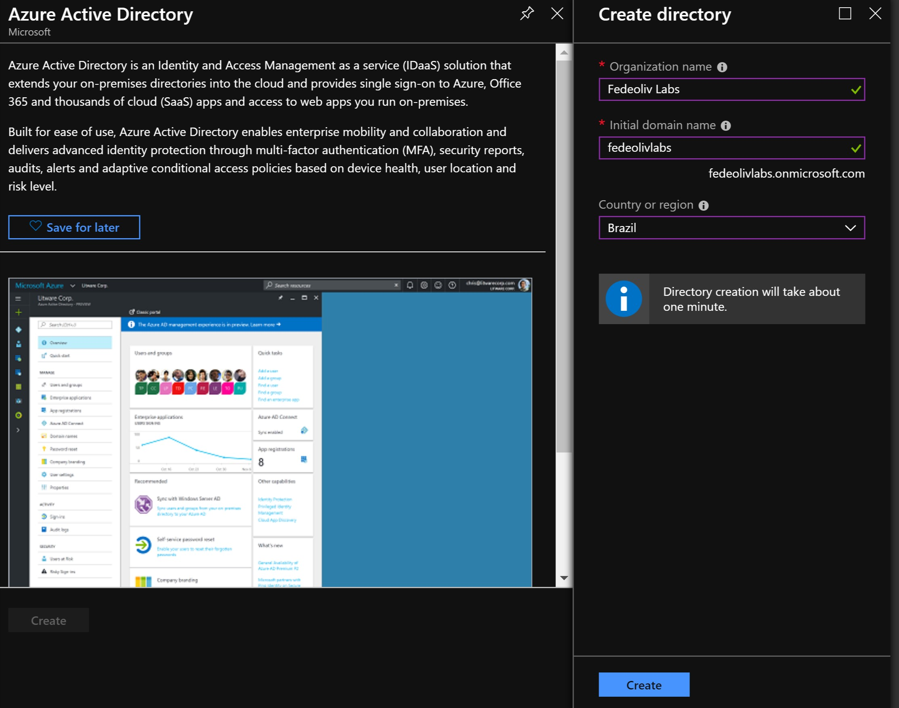

Switch to the new directory on Portal, then click on `Azure Active Directory` and make sure it's pointing to the new directory.

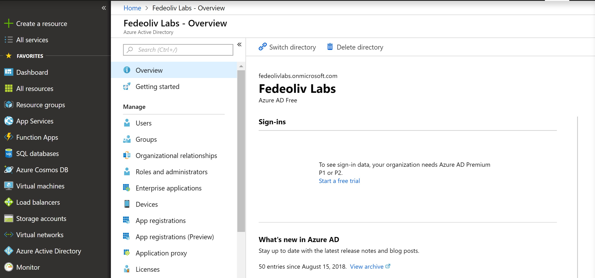

### **Azure Subscription**

If you don't have an Azure subscription for the tenant, you can get a free account [here](https://azure.microsoft.com/en-us/free/).

### **Copy your tenant ID**

In the next steps, you'll need to know the tenant ID to provision Active Directory applications. In the Azure Portal, go to your user info and select `Switch directory`. 

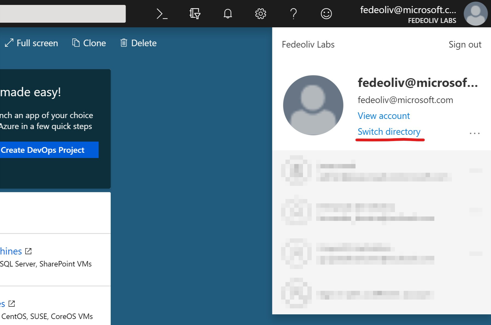

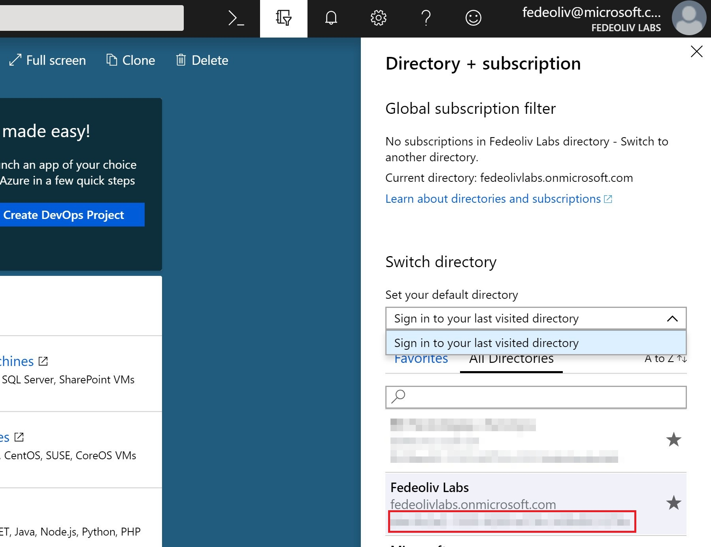

### **Switch to the new tenant on Azure CLI**

Now prepare your Azure CLI to login in the new tenant:

    $ az login -t your_tenant_id
    

### **Active Directory applications**

To enable Azure AD authorization for Kubernetes, you need to create two applications: **server** and **client** apps.

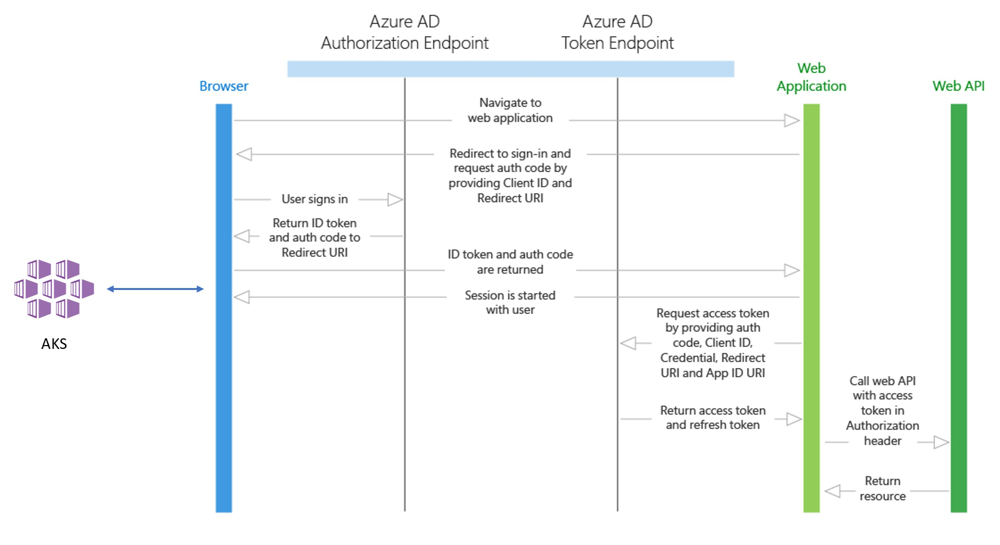

- **Server application:** It's a *Web app/API* that will be used to get a users Azure AD group membership. The web app obtains an `access token` for the user, which proves to the web API that the user successfully authenticated to the web app and the web app was able to obtain a delegated user identity to call the web API. This access token is sent in the request to the web API, which authorizes the user and returns the desired resource. For more info about *Web app/API* [here](https://docs.microsoft.com/en-us/azure/active-directory/develop/web-api).

- **Client application:** It's a *native* application that will be used when logging in with the Kubernetes CLI (known as `kubectl`). The client app obtains an `access token` for the user by using the `OAuth 2.0 protocol`. This access token is then sent in the request to the server app (web API), which authorizes the user and returns the desired resource. For more info about *native* apps [here](https://docs.microsoft.com/en-us/azure/active-directory/develop/native-app).

### **Create the server application**

These are the environment variables needed to create the server application:

| Variable | Description
| -------------- | -------------- |
| RBAC_AZURE_TENANT_ID | Paste the tenant ID you copied from the `Copy your tenant ID` section. |
| RBAC_SERVER_APP_NAME | Set your preferred server application name. |
| RBAC_SERVER_APP_URL | Set your application URL based on the application name. |
| RBAC_SERVER_APP_SECRET | Set your preferred application secret. The pre-defined script generates a 32-character hex random secret. |


Access the `scripts/azure-ad` directory and open the `create-server-app.sh` script in your preferred text editor to edit the environment variables:

```bash
export RBAC_AZURE_TENANT_ID="YOUR_TENANT_ID"
export RBAC_SERVER_APP_NAME="YOUR_APP_NAME"
export RBAC_SERVER_APP_URL="http://your_app_name"
export RBAC_SERVER_APP_SECRET="$(cat /dev/urandom | tr -dc 'a-zA-Z0-9' | fold -w 32 | head -n 1)"
```

Then run the script:

    ./create-server-app.sh

After the server app creation, copy these environment variables: **RBAC_SERVER_APP_ID**, **RBAC_SERVER_APP_OAUTH2PERMISSIONS_ID** and **RBAC_SERVER_APP_SECRET**. You will need these variables to create the client application.

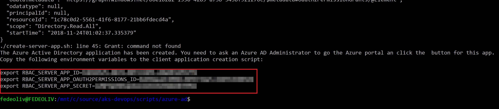

Now open the Azure Portal and search for the server application on `Azure Active Directory -> App registrations -> View all applications -> YOUR_APP_NAME -> Settings -> Required Permissions`. Click on `Grant permissions` button and accept to permissions for your tenant:

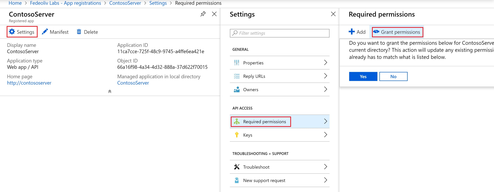

***Note: You need to have admin permissions to grant app permissions. Otherwise, you will receive an HTTP 403 Forbidden error.***

### **Create the client application**

These are the environment variables needed to create the client application:

| Variable | Description
| -------------- | -------------- |
| RBAC_AZURE_TENANT_ID | Paste the tenant ID you copied from the `Copy your tenant ID` section. |
| RBAC_CLIENT_APP_NAME | Set your preferred client application name. |
| RBAC_CLIENT_APP_URL | Set your application URL based on the application name. |
| RBAC_SERVER_APP_ID | ID generated after the creation of server application. |
| RBAC_SERVER_APP_OAUTH2PERMISSIONS_ID | OAuth 2.0 permissions ID generated after the creation of server application. |
| RBAC_SERVER_APP_SECRET | The same secret used for the server application. |

If you don't have access to **RBAC_SERVER_APP_ID** and **RBAC_SERVER_APP_OAUTH2PERMISSIONS_ID**  values anymore, you can get in the Azure Portal. Go to `Azure Active Directory -> App registrations -> View all applications -> YOUR_SERVER_APP_NAME -> Manifest` and open the json file. Search by `appId` and `oauth2Permissions.id`.

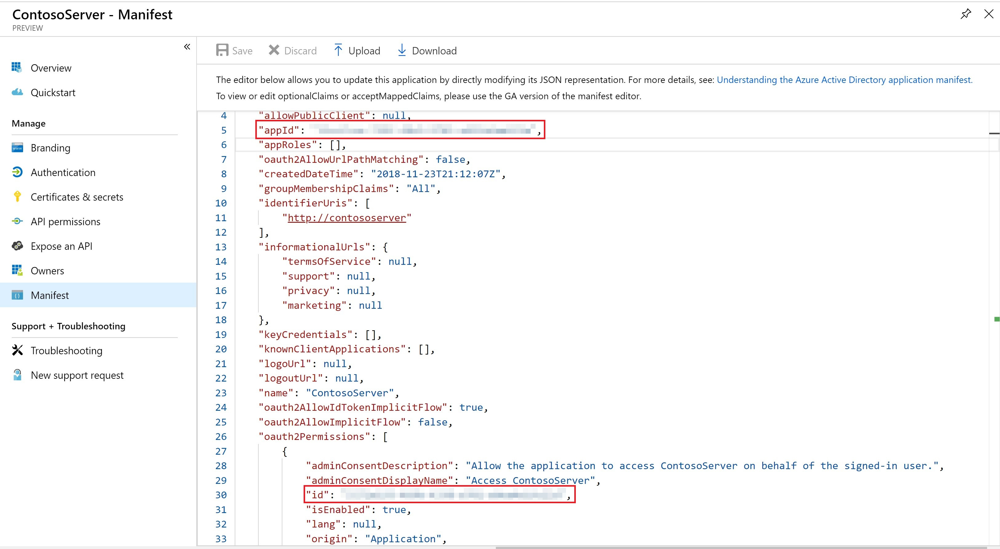

Access the `scripts/azure-ad` directory and open the `create-client-app.sh` script in your preferred text editor to edit the environment variables:

```bash
export RBAC_AZURE_TENANT_ID="YOUR_TENANT_ID"
export RBAC_CLIENT_APP_NAME="YOUR_APP_NAME"
export RBAC_CLIENT_APP_URL="http://your_app_name"

export RBAC_SERVER_APP_ID="YOUR_SERVER_APP_ID"
export RBAC_SERVER_APP_OAUTH2PERMISSIONS_ID="YOUR_SERVER_OAUTH_PERMISSIONS_ID"
export RBAC_SERVER_APP_SECRET="YOUR_SERVER_SECRET"
```

Then run the script:

    ./create-client-app.sh

Copy all **TF_VAR_*** environment values to be used in the next step.

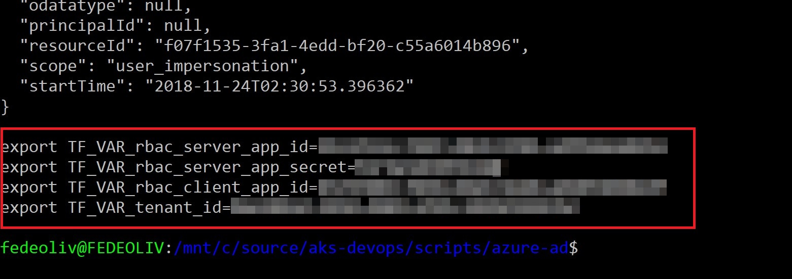

## Step 3: Create Infrastructure as Code

We are going to use [Terraform](https://www.terraform.io/https://www.terraform.io/) for building, changing, and versioning our infrastructure safely and efficiently. First, you have to create an Azure AD service principal, following the tutorial described [here](https://docs.microsoft.com/en-us/azure/virtual-machines/linux/terraform-install-configure?toc=%2Fen-us%2Fazure%2Fterraform%2Ftoc.json&bc=%2Fen-us%2Fazure%2Fbread%2Ftoc.json#set-up-terraform-access-to-azure) to enable Terraform to provision resources into Azure.

### **Configure Terraform state backend**

We are going to use Terraform `state backend`, enabling Terraform to know what Azure resources to add, update, or delete by using a remote storage. When using a state backend, the state file is stored in a data store such as Azure Storage.

Now we're going to create two resources:

| Resource Name | Description
| -------------- | -------------- |
| [Azure Storage](https://azure.microsoft.com/en-us/services/storage/) | Used to store Terraform state files. |
| [Azure Key Vault](https://azure.microsoft.com/en-us/services/key-vault/) | Used to store secrets for data protection. |

In the `scripts/terraform` directory, run the following script:

    ./create-state-resources.sh

The script will automatically create both resources and add the account access key as a secret in Key Vault:

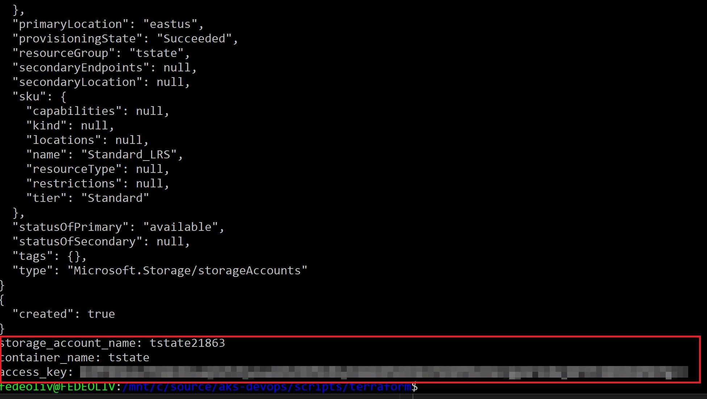

### **Create Multiple Environments**

[Terraform Workspaces](https://www.terraform.io/docs/state/workspaces.html) allows you to manage multiple distinct sets of infrastructure resources/environments. Run the `create-workspaces.sh` script to create `dev`, `tst`, `stg` and `prod` workspaces:

    ./create-workspaces.sh  

Now run the following command to make sure all workspaces were created:

    terraform workspace list

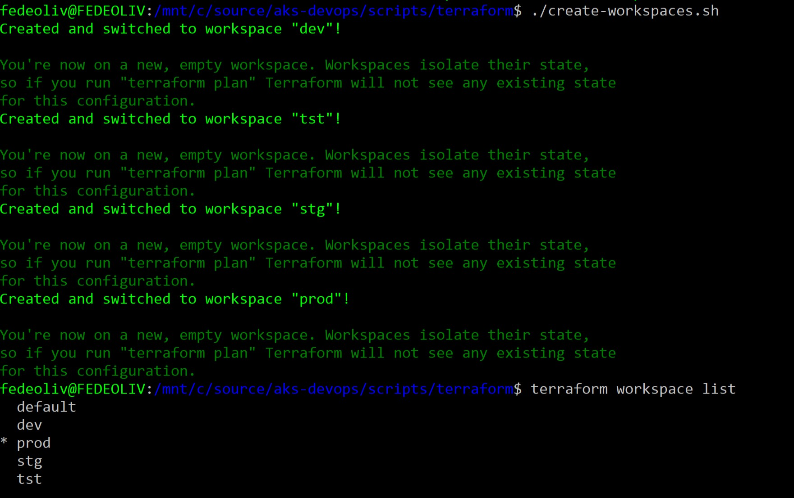

### **Initialize Terraform**

We have to initialize Terraform for each workspace (dev, tst, stg and prod). First, let's select the **prod** environment:

    terraform workspace select prod

Now you're ready to deploy resources for production. Initialize Terraform, linking to the storage account:

```sh
terraform init -backend-config="storage_account_name=YOUR_STORAGE_ACCOUNT_NAME" \
    -backend-config="container_name=tstate" \
    -backend-config="access_key=$(az keyvault secret show --name terraform-backend-key --vault-name contosokvault --query value -o tsv)" \
    -backend-config="key=NAME_OF_YOUR_STATE_FILE.tfstate"
````

Now access the `scripts/azure-ad` directory and open the `variables.tf` file in a text editor. Update all empty variables with your client and server application IDs and secrets:

```hcl
variable "client_id" {
    default = ""
}
variable "client_secret" {
    default = ""
}
variable "tenant_id" {
    default = ""
}
variable "rbac_server_app_id" {
    default = ""
}
variable "rbac_server_app_secret" {
    default = ""
}
variable "rbac_client_app_id" {
    default = ""
}
```

Run the following command to start the execution plan and wait for the AKS to be completed:

    terraform apply


