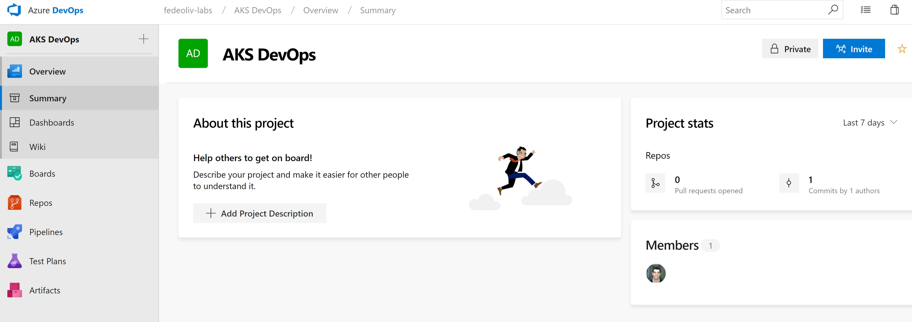

# Azure Kubernetes Service DevOps

This is a lab to create a zero downtime scenario for Azure Kubernetes Service (AKS).

## Prerequisties

- [Git](https://git-scm.com/book/en/v2/Getting-Started-Installing-Git) for Windows or Linux
- [Docker](https://docs.docker.com/install/) for Windows or Linux
- [Terraform](https://www.terraform.io/intro/getting-started/install.html) for Windows or Linux
- Visual Studio 2017 with [Visual Studio Tools for Kubernetes](https://marketplace.visualstudio.com/items?itemName=ms-azuretools.vs-tools-for-kubernetes)
- Azure Subscription

## Step 1: Setup an Azure DevOps Project

Azure DevOps Services allows you to easily set up automated pipelines to build, test and deploy your code to any platform. We are going to use Azure DevOps as our default platform. If you don't have an account, you can create one [here](https://azure.microsoft.com/en-us/services/devops/).

Now you can clone the repository locally:

    git clone https://<organization_name>@dev.azure.com/<organization_name>/<project_name>/_git/<project_name>
