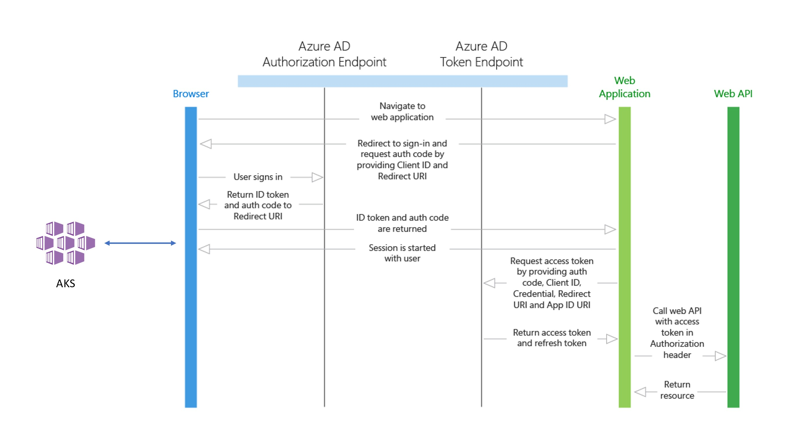
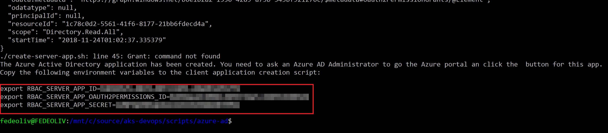
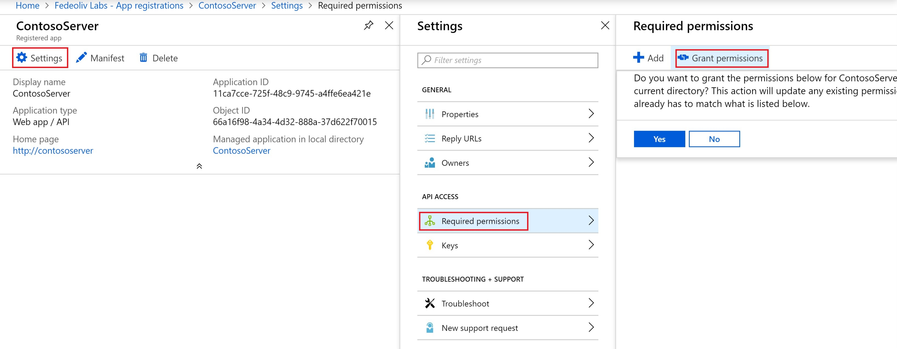
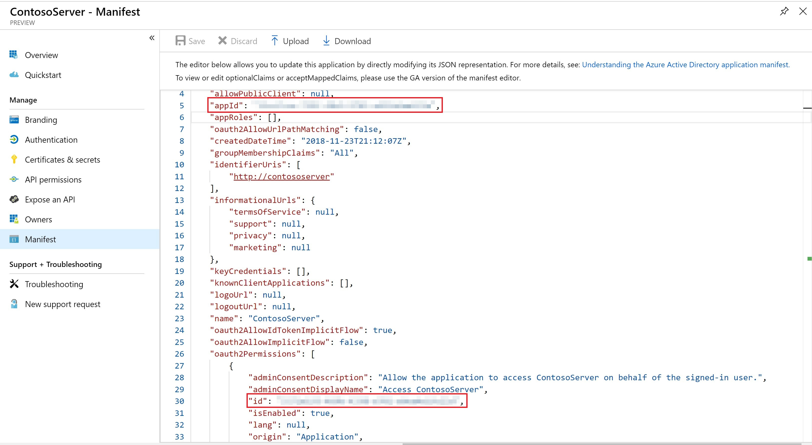
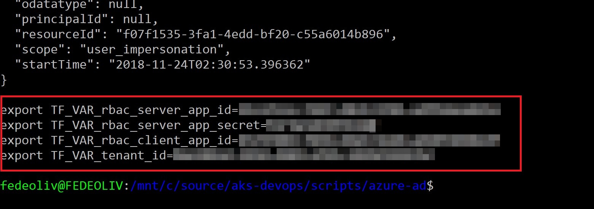

# Step 1: Setup Azure Active Directory for AKS authentication

AKS can be configured to use Azure Active Directory (AD) for user authentication. In this configuration, you can log into an AKS cluster using your Azure Active Directory authentication token. If you want to understand more about the authenticaton details you can find more info [here](https://docs.microsoft.com/en-us/azure/aks/aad-integration#authentication-details).

## Active Directory tenant

Integration with Active Directory requires a *tenant*. If you already have a tenant but want to create a new one, you can follow the tutorial [here](https://docs.microsoft.com/en-us/azure/active-directory/develop/quickstart-create-new-tenant#create-a-new-azure-ad-tenant).

## Azure Subscription

Create new resources requires an Azure subscription. If you don't have it for the tenant, you can get a free account [here](https://azure.microsoft.com/en-us/free/) or create an enterprise subscription.

## Copy your tenant ID

In the next steps, you'll need to know the tenant ID to provision Active Directory applications. We can get it from the Azure CLI:

First, sign in with your account:

    az login

Now list your accounts:

    az account list

In the JSON structure, copy the `tenantId` value. Additionaly, you can get the tenant ID from the Azure Portal (`Active Directory -> Properties -> Directory ID`).

## Active Directory applications

To enable Azure AD authorization for Kubernetes, you need to create two applications: **server** and **client** apps.



- **Server application:** It's a *Web app/API* that will be used to get a users Azure AD group membership. The web app obtains an `access token` for the user, which proves to the web API that the user successfully authenticated to the web app and the web app was able to obtain a delegated user identity to call the web API. This access token is sent in the request to the web API, which authorizes the user and returns the desired resource. For more info about *Web app/API* [here](https://docs.microsoft.com/en-us/azure/active-directory/develop/web-api).

- **Client application:** It's a *native* application that will be used when logging in with the Kubernetes CLI (known as `kubectl`). The client app obtains an `access token` for the user by using the `OAuth 2.0 protocol`. This access token is then sent in the request to the server app (web API), which authorizes the user and returns the desired resource. For more info about *native* apps [here](https://docs.microsoft.com/en-us/azure/active-directory/develop/native-app).

## Create the server application

These are the environment variables needed to create the server application:

| Variable | Description
| -------------- | -------------- |
| RBAC_AZURE_TENANT_ID | Paste the tenant ID you copied from the `Copy your tenant ID` section. |
| RBAC_SERVER_APP_NAME | Set your preferred server application name. |
| RBAC_SERVER_APP_URL | Set your application URL based on the application name. |
| RBAC_SERVER_APP_SECRET | Set your preferred application secret. The pre-defined script generates a 32-character hex random secret. |


Access the `scripts/azure-ad` directory and open the `create-server-app.sh` script in your preferred text editor to edit the environment variables:

```bash
export RBAC_AZURE_TENANT_ID="YOUR_TENANT_ID"
export RBAC_SERVER_APP_NAME="YOUR_APP_NAME"
export RBAC_SERVER_APP_URL="http://your_app_name"
export RBAC_SERVER_APP_SECRET="$(cat /dev/urandom | tr -dc 'a-zA-Z0-9' | fold -w 32 | head -n 1)"
```

Then run the script:

    ./create-server-app.sh

After the server app creation, copy these environment variables: **RBAC_SERVER_APP_ID**, **RBAC_SERVER_APP_OAUTH2PERMISSIONS_ID** and **RBAC_SERVER_APP_SECRET**. You will need these variables to create the client application.



Now open the Azure Portal and search for the server application on `Azure Active Directory -> App registrations -> View all applications -> YOUR_APP_NAME -> Settings -> Required Permissions`. Click on `Grant permissions` button and accept to permissions for your tenant:



***Note: You need to have admin permissions to grant app permissions. Otherwise, you will receive an HTTP 403 Forbidden error.***

## Create the client application

These are the environment variables needed to create the client application:

| Variable | Description
| -------------- | -------------- |
| RBAC_AZURE_TENANT_ID | Paste the tenant ID you copied from the `Copy your tenant ID` section. |
| RBAC_CLIENT_APP_NAME | Set your preferred client application name. |
| RBAC_CLIENT_APP_URL | Set your application URL based on the application name. |
| RBAC_SERVER_APP_ID | ID generated after the creation of server application. |
| RBAC_SERVER_APP_OAUTH2PERMISSIONS_ID | OAuth 2.0 permissions ID generated after the creation of server application. |
| RBAC_SERVER_APP_SECRET | The same secret used for the server application. |

If you don't have access to **RBAC_SERVER_APP_ID** and **RBAC_SERVER_APP_OAUTH2PERMISSIONS_ID**  values anymore, you can get in the Azure Portal. Go to `Azure Active Directory -> App registrations -> View all applications -> YOUR_SERVER_APP_NAME -> Manifest` and open the json file. Search by `appId` and `oauth2Permissions.id`.



Access the `scripts/azure-ad` directory and open the `create-client-app.sh` script in your preferred text editor to edit the environment variables:

```bash
export RBAC_AZURE_TENANT_ID="YOUR_TENANT_ID"
export RBAC_CLIENT_APP_NAME="YOUR_APP_NAME"
export RBAC_CLIENT_APP_URL="http://your_app_name"

export RBAC_SERVER_APP_ID="YOUR_SERVER_APP_ID"
export RBAC_SERVER_APP_OAUTH2PERMISSIONS_ID="YOUR_SERVER_OAUTH_PERMISSIONS_ID"
export RBAC_SERVER_APP_SECRET="YOUR_SERVER_SECRET"
```

Then run the script:

    ./create-client-app.sh

Copy all **TF_VAR_*** environment values to be used in the next step.



## Next Steps

Now we can go to the next step: [Create Infrastructure as Code](./infrastructure-setup.md).
