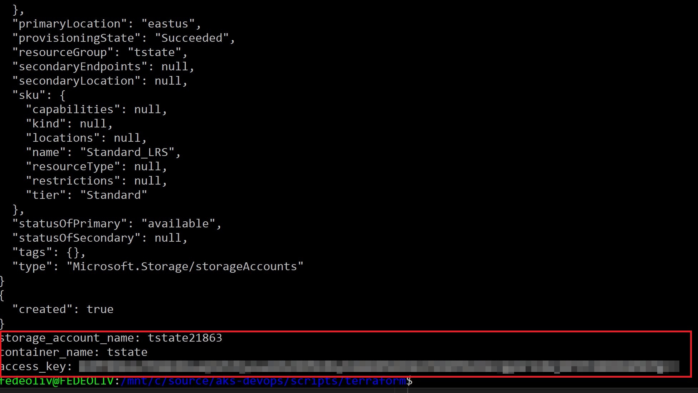

# Step 2: Create Infrastructure as Code

We are going to use [Terraform](https://www.terraform.io/https://www.terraform.io/) for building, changing, and versioning our infrastructure safely and efficiently. First, you have to create an Azure AD service principal, following the tutorial described [here](https://docs.microsoft.com/en-us/azure/virtual-machines/linux/terraform-install-configure?toc=%2Fen-us%2Fazure%2Fterraform%2Ftoc.json&bc=%2Fen-us%2Fazure%2Fbread%2Ftoc.json#set-up-terraform-access-to-azure) to enable Terraform to provision resources into Azure.

## Environments Resources

This is an overview of all Kubernetes clusters that will be created by Terraform:

| Environment | Resource Group | Cluster Name | Nodes | OS 
| -------------- | -------------- | -------------- | -------------- | -------------- |
| prod | rg-contoso | contosocluster | 3 (Standard_DS2_v2) | Linux (30GB disk size) |
| stg | rg-contoso-stg | contosoclusterstg | 3 (Standard_DS2_v2) | Linux (30GB disk size) |
| tst | rg-contoso-tst | contosoclustertst | 1 (Standard_B2s) | Linux (30GB disk size) |
| dev | rg-contoso-dev | contosoclusterdev | 1 (Standard_B2s) | Linux (30GB disk size) |

These resources will be created due to some assumptions:

- We want a staging system that *exactly mimics the production system*. We are going to create an exact replica of the production cluster instead of working in a single cluster with *namespaces*  specially because we want to avoid any unnecessary side effects (performance impact, for example).
- For tst and dev environments you can create separate clusters or work on a single cluster using namespaces.

Therefore it's important to mention **the number of resources to be created will vary according to your requirements and decisions based on risk, cost and complexity**.


## Configure Terraform state backend

We are going to use Terraform `state backend`, enabling Terraform to know what Azure resources to add, update, or delete by using a remote storage. When using a state backend, the state file is stored in a data store such as Azure Storage.

Now we're going to create two resources:

| Resource Name | Description
| -------------- | -------------- |
| [Azure Storage](https://azure.microsoft.com/en-us/services/storage/) | Used to store Terraform state files. |
| [Azure Key Vault](https://azure.microsoft.com/en-us/services/key-vault/) | Used to store secrets for data protection. |

In the `scripts/terraform` directory, open the `create-state-resources.sh` file in a text editor and add a key vault name:

```sh
KV_NAME=<your_keyvault_name>
```

Then run the script:

    ./create-state-resources.sh

The script will automatically create both resources and add the account access key as a secret in Key Vault:



## Create Multiple Environments

[Terraform Workspaces](https://www.terraform.io/docs/state/workspaces.html) allows you to manage multiple distinct sets of infrastructure resources/environments. Run the `create-workspaces.sh` script to create `dev`, `tst`, `stg` and `prod` workspaces:

    ./create-workspaces.sh  

Now run the following command to make sure all workspaces were created:

    terraform workspace list


## Initialize Terraform

Initialize Terraform, linking to the storage account:

```sh
terraform init -backend-config="storage_account_name=YOUR_STORAGE_ACCOUNT_NAME" \
    -backend-config="container_name=tstate" \
    -backend-config="access_key=$(az keyvault secret show --name terraform-backend-key --vault-name contosokvault --query value -o tsv)" \
    -backend-config="key=NAME_OF_YOUR_STATE_FILE.tfstate"
````

## Create Service Principals

When you create an AKS cluster, Azure requires a service principal for each cluster you create. Open the `create-service-principals.sh` file in a text editor and add your key vault name:

```sh
KV_NAME=<your_keyvault_name>
```

Then run the script:

    ./create-service-principals.sh

The script will create 4 service principals with 32-character hex random secret for each one, where all secrets are stored in your Key Vault.

## Update Environment Variables

Access the `scripts/azure-ad` directory and open the `variables.tf` file in a text editor. Update all empty variables:

```hcl
# AKS RBAC
variable "tenant_id" {
    description = "Tenant ID used for AKS RBAC"
    default = ""
}
variable "rbac_server_app_id" {
    description = "AAD server app ID used for AKS RBAC"
    default = ""
}
variable "rbac_server_app_secret" {
    description = "AAD server app secret used for AKS RBAC"
    default = ""
}
variable "rbac_client_app_id" {
    description = "AAD client app ID used for AKS RBAC"
    default = ""
}
```

In the service principals variables section, update all `vault_uri` with your Key Vault name. For example:

```hcl
data "azurerm_key_vault_secret" "sp_secret_dev" {
  name      = "sp-secret-dev"
  vault_uri = "https://<your_keyvault_name>.vault.azure.net/"
}
```

## Create/Update Resources

We have to create/update resources for each workspace (dev, tst, stg and prod). First, let's select the **dev** environment:

    terraform workspace select dev

Run the following command to start the execution plan and wait for the AKS to be completed:

    terraform apply

Repeat the process until all environments are completed (you can reuse server and client apps for all environments).
